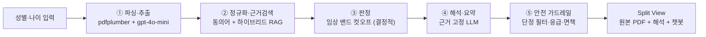

# GoGoDoc — 종합검진 결과 AI 해석 서비스

GoGoDoc 은 디지털 PDF 형식의 종합검진 결과지를 입력받아 검사 수치를 일반 사용자가 이해할 수 있는 언어로 해석하고, 후속 관리·추적 항목을 정리하는 AI 해석 서비스다.

> ⚠️ 본 서비스는 의료 진단을 대체하지 않는다. 모든 해석은 참고용이며 정확한 판단은 반드시 의료진과 상담해야 한다.

📑 **[발표자료 (Google Slides)](https://docs.google.com/presentation/d/1-_PXOiKDJe2KWIQ1pWdMPWZ_X__fDRKm/edit)**  ·  📖 **[프로젝트 위키](https://github.com/GoGoDoct/GoGoDoc/wiki)**  ·  📋 **[기능 명세 (SPEC)](docs/SPEC.md)**

> 아키텍처·RAG·안전 가드레일·기술 의사결정(ADR) 등 상세 문서는 **[위키](https://github.com/GoGoDoct/GoGoDoc/wiki)** 에 정리되어 있다. 본 문서는 개요와 실행 방법을 다룬다.

## 팀 구성 및 역할 분담

|  |  |  |
|:---:|:---:|:---:|
| **규진**<br/>[@gyujin00](https://github.com/gyujin00) | **희정**<br/>[@heejeongJ](https://github.com/heejeongJ) | **석준**<br/>[@SJvaca30](https://github.com/SJvaca30) |
| • 사용자 인증·세션 관리 (F-001)<br/>• PDF 업로드 검증 + LLM 연동 (F-002)<br/>• 분석 결과 DB 저장·대시보드 연동<br/>• 병원 추천 서비스·HIRA 연동 (F-006)<br/>• 인증·대시보드·결과 화면 UI | • 의료 근거 데이터 구축 (해설 dict·임상 밴드·패닉 밸류·동의어)<br/>• 항목 정규화·판정 (성별·나이) (F-003)<br/>• 근거 검색 RAG (Dict·pgvector·하이브리드)<br/>• AI 해석·종합 요약·안전 가드레일 (F-004)<br/>• 평가 하네스·골든셋·대시보드 | • 챗봇 질문 유형 분류·라우팅 (F-007)<br/>• 위험 질문 하드 차단·안전 게이트<br/>• 챗봇 답변 서비스·UI 호출 계약<br/>• 챗봇 항목명 매칭 (최신 결과 내)<br/>• 챗봇 평가·골든셋 임상 채점 |

## 개요 (Overview)

사용자의 성별·나이와 검진 결과지(디지털 PDF) 1건을 입력으로 받아 다음을 산출한다.

- **항목별 판정** — 정상 / 주의 / 이상 / 응급 (결정적 임상 밴드 규칙)
- **근거 기반 해설** — 공인 출처 근거 위에서만 생성 (환각 억제)
- **생활 가이드 · 추적 체크리스트** — 다음 검진에서 관리할 항목
- **결과 기반 챗봇** — 검진 결과를 컨텍스트로 한 질의응답 (위험 질문은 전문의 상담으로 라우팅)

설계 전반은 세 가지 원칙을 따른다 — **판정은 결정적 규칙**, **해설은 공인 출처 근거 위에서만**, **안전 최우선**.

기능 목록(F-001~F-007)·담당·데이터 모델은 [docs/SPEC.md](docs/SPEC.md), 상세 설계는 [위키 › 서비스 개요](https://github.com/GoGoDoct/GoGoDoc/wiki/1.-서비스-개요) 참고.

## 처리 파이프라인 (Pipeline)



단계별 책임·불변식은 [위키 › 해석 파이프라인](https://github.com/GoGoDoct/GoGoDoc/wiki/5.-해석-파이프라인) 참고.

## 시스템 아키텍처 (Architecture)

백엔드는 실용 Hexagonal (Ports & Adapters), 화면은 통합 Streamlit 앱(`app.py`)으로 구성된다. 의존성은 항상 도메인 안쪽을 향한다.

```
Streamlit app.py
   ↓ composition 으로 어댑터 주입
application (파이프라인·인증·챗봇·포트)  →  domain (순수 규칙)
   ↑
infrastructure (OpenAI · pdfplumber · pdf2image · PostgreSQL · pgvector · HIRA)
```

계층 책임·포트·폴백 설계는 [위키 › 시스템 아키텍처](https://github.com/GoGoDoct/GoGoDoc/wiki/4.-시스템-아키텍처) 참고.

## 기술 스택 (Tech Stack)

| 레이어 | 선택 |
|--------|------|
| UI | Streamlit |
| PDF 파싱 / 렌더링 | pdfplumber / pdf2image (poppler 필요) |
| 수치 구조화 · 해석 | Pydantic v2 + OpenAI gpt-4o-mini |
| 항목 정규화 | dict 동의어 + rapidfuzz |
| 판정 | 항목별 임상 밴드 컷오프 (순수 규칙) |
| 근거 검색 | dict / pgvector / **hybrid**(권장), 임베딩 text-embedding-3-small |
| 저장소 | PostgreSQL (pgvector 확장) |
| 병원 검색 | HIRA 공공데이터 API |

레이어별 선택 근거·LLM 사용 정책은 [위키 › 기술 스택](https://github.com/GoGoDoct/GoGoDoc/wiki/2.-기술-스택) 참고.

## 설치 및 실행 (Getting Started)

### 사전 요구사항

- Python 3.11 / 3.12 권장
- poppler — macOS `brew install poppler` / Ubuntu `sudo apt-get install poppler-utils`
- PostgreSQL (로그인·분석 기록) — 직접 구동하거나 아래 Docker 사용

### 로컬 실행

```bash
python -m venv .venv && source .venv/bin/activate
pip install -r requirements.txt

cp .env.example .env          # OPENAI_API_KEY·DB 접속 정보·RETRIEVER 설정
streamlit run app.py
```

### Docker 실행 (앱 + pgvector Postgres)

poppler 등 시스템 의존성이 이미지에 포함되어 별도 설치가 필요 없다.

```bash
cp .env.example .env          # OPENAI_API_KEY 입력
docker compose up --build     # http://localhost:8501
```

### 근거 검색 옵션 (retriever)

`.env` 의 `RETRIEVER` 로 선택한다. 검색은 해석 근거에만 쓰이며, 판정은 항상 결정적 규칙을 따른다.

| 값 | 설명 | DB |
|----|------|----|
| `dict` | 동의어 사전 정확매칭 (무지연·가장 안전) | 아니오 |
| `pgvector` | 벡터 단독 (비권장) | 예 |
| `hybrid` | **권장** — dict 우선 + 사전 미등록 변형은 벡터 폴백 | 예 |

```bash
docker compose up -d db                                       # pgvector Postgres
docker compose run --rm app python -m scripts.index_reference  # 근거 임베딩 색인
# .env 에 RETRIEVER=hybrid 설정 후 앱 실행
```

임계값 캘리브레이션·하이브리드 채택 근거는 [위키 › RAG 파이프라인](https://github.com/GoGoDoct/GoGoDoc/wiki/6.-RAG-파이프라인) · [docs/RAG_METRICS.md](docs/RAG_METRICS.md) 참고.

## 평가 (Evaluation)

`evaluation/` 가 골든셋으로 검색·판정·생성·챗봇 품질을 상시 채점하고 시계열로 누적한다.

| 평가 | 결과 (베이스라인) |
|------|-------------------|
| 핵심 회귀 (dict, 48건) | 정규화·검색 정답률·분류·출처 **전 지표 100% · 오적중 0** |
| 팀 골든 임상 (100건) | Correctness **100%** · Emergency Recall **100%** · Over-warning **0%** |
| 생성 LLM 실측 (43건) | 수치 환각률 **0%** · 응급 긴급성 누락 **0** |
| 챗봇 스코프 (24건) | 위험질문 차단율 **100%** |
| 챗봇 RAG 답변 (10건) | 근거 적중·출처 인용 **100%** · 환각 **0%** |

```bash
python evaluation/eval_rag.py                    # 검색·정규화·판정 (결정적)
python evaluation/clinical_eval.py               # 팀 골든 임상 채점
python evaluation/retrieval_eval.py              # Recall@3·Negative Retrieval·Coverage
python evaluation/gen_eval.py                    # 생성 LLM-judge (Groundedness·환각, OPENAI_API_KEY)
python evaluation/chat_eval.py --no-log          # F-007 질문 라우팅·위험질문 차단율
python evaluation/chat_answer_eval.py --no-log   # F-007 챗봇 RAG 답변 근거성
python evaluation/chat_answer_service_eval.py --no-log  # F-007 최신 결과 연결·LLM 호출 정책
python evaluation/chat_item_match_eval.py --no-log      # F-007 항목명 유사 입력 매칭
RETRIEVER=hybrid python evaluation/variant_eval.py      # 하이브리드 변형 구제 효과 (DB)
streamlit run evaluation/dashboard.py            # 지표 추이 대시보드
pytest                                           # 도메인·애플리케이션 테스트 (API 키·네트워크 불요)
```

`--no-log` 없이 실행한 평가는 `evaluation/history/runs.jsonl`(gitignore) 에 누적되고, 대시보드가 주요 RAG·챗봇 평가 추이를 표시한다. 지표 정의·목표치·측정 기록은 [docs/RAG_METRICS.md](docs/RAG_METRICS.md), 하네스 설계는 [위키 › 평가 하네스](https://github.com/GoGoDoct/GoGoDoc/wiki/13.-ADR-B3-평가-하네스) 참고.

## 디렉터리 구조 (Project Layout)

```
GoGoDoc/
├── app.py                  Streamlit 진입점 (로그인·대시보드·검진 해석)
├── gogodoc/                백엔드 패키지 (Hexagonal)
│   ├── domain/             순수 규칙 (models·policy·services·reference)
│   ├── application/        파이프라인·포트·프롬프트·인증·챗봇
│   ├── infrastructure/     OpenAI·PDF·retrieval(dict·pgvector·hybrid)·HIRA·DB
│   └── composition.py      컴포지션 루트 (어댑터 주입)
├── scripts/                reference·정성 소견 pgvector 색인
├── evaluation/             골든셋·채점 하네스·대시보드
├── docs/                   SPEC.md · RAG_METRICS.md
└── tests/                  domain·application·infrastructure 테스트
```

## 문서 (Documentation)

| 구분 | 문서 |
|------|------|
| 서비스 | [개요](https://github.com/GoGoDoct/GoGoDoc/wiki/1.-서비스-개요) · [기술 스택](https://github.com/GoGoDoct/GoGoDoc/wiki/2.-기술-스택) · [도메인](https://github.com/GoGoDoct/GoGoDoc/wiki/3.-도메인) |
| 아키텍처 | [시스템 아키텍처](https://github.com/GoGoDoct/GoGoDoc/wiki/4.-시스템-아키텍처) · [해석 파이프라인](https://github.com/GoGoDoct/GoGoDoc/wiki/5.-해석-파이프라인) · [RAG 파이프라인](https://github.com/GoGoDoct/GoGoDoc/wiki/6.-RAG-파이프라인) · [안전 가드레일](https://github.com/GoGoDoct/GoGoDoc/wiki/7.-안전-가드레일) |
| 기술 의사결정 (ADR) | [A1 판정 모델](https://github.com/GoGoDoct/GoGoDoc/wiki/8.-ADR-A1-판정-모델) · [A2 근거 검색 진화](https://github.com/GoGoDoct/GoGoDoc/wiki/9.-ADR-A2-근거-검색-백엔드-진화) · [A3 Hexagonal](https://github.com/GoGoDoct/GoGoDoc/wiki/10.-ADR-A3-Hexagonal-아키텍처) · [B1 안전 다층 방어](https://github.com/GoGoDoct/GoGoDoc/wiki/11.-ADR-B1-안전-가드레일-다층-방어) · [B2 챗봇 스코프 분류](https://github.com/GoGoDoct/GoGoDoc/wiki/12.-ADR-B2-챗봇-스코프-분류) · [B3 평가 하네스](https://github.com/GoGoDoct/GoGoDoc/wiki/13.-ADR-B3-평가-하네스) |

## 의료 책임 경계 (Safety & Compliance)

- 모든 출력에 "참고용·진단 아님" 면책 강제, 단정 표현 후처리 차단
- 응급 이상치 감지 시 즉시 내원 안내 최우선
- 해설 dict 근거 내에서만 설명(RAG), 출처 없는 추론 차단
- 업로드 PDF 는 세션 내 처리 후 즉시 삭제, 서버 미저장

다층 방어 설계는 [위키 › 안전 가드레일](https://github.com/GoGoDoct/GoGoDoc/wiki/7.-안전-가드레일) 참고.

## 데이터 출처 (References)

해설 dict 근거 — 질병관리청 국가건강정보포털, 대한당뇨병학회·고혈압학회, 서울아산병원, 건강보험심사평가원(HIRA) 등 공인 출처.
